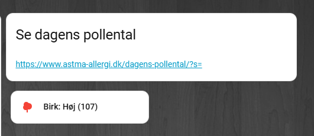

# HA DK Pollen

Home Assistant configuration for Danish pollen data from Astma-Allergi Danmark.


## Supported pollen types

- Birk
- Græs
- Bynke
- Hassel
- El / Elm
- Alternaria
- Cladosporium

## Dashboard example

Uses Mushroom cards with conditional visibility (only Moderate/High shown)

## Features

- REST sensor (robust parsing af API)
- Template sensorer (niveau: Lav / Moderat / Høj)
- Visibility sensorer til dashboard chips
- Klar til Mushroom cards / conditional chips

## Requirements

- Home Assistant 2024+
- Template integration (ny struktur)

### Created with help from ChatGPT and tested in Home Assistant.

## License
MIT

## Installation

Kopier filer til din HA config:

```yaml
rest: !include_dir_merge_list entities/rest
template: !include_dir_merge_list entities/templates

